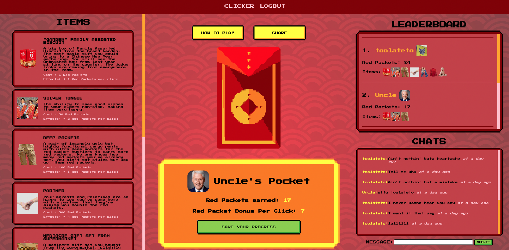
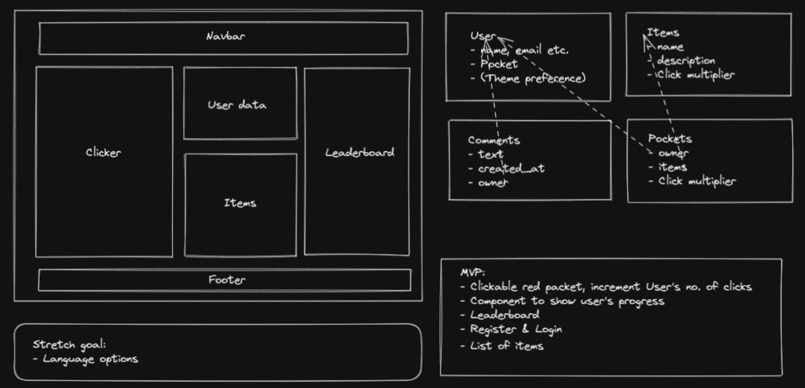
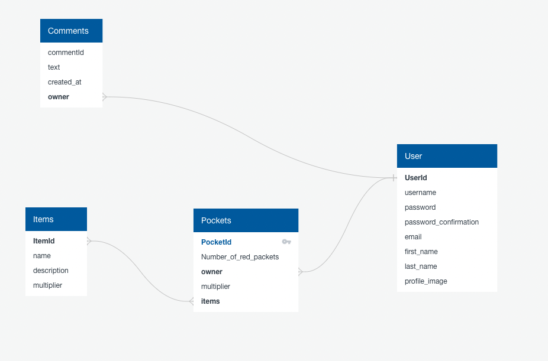

# GA-PROJECT-04-CLIENT

## Description

Red Packet Clicker is a mobile responsive full stack app that is a one-page clicker game developed with Django, PostgreSQL, React and Node. The 8-bit style game features a user database, unlockable items, leaderboard and a chat function. The items in the app are sarcastic comedic takes on the traditions in Hong Kong. Use this app to spice up the way of giving out red packets during Lunar New Year!



## Deployment Link

https://red-packet-clicker.netlify.app/

## Installation

Run these commands at the root of the code folder:

### Back End

To access the database:

`$ pipenv shell`

To install packages:

`$ pipenv install`

To load preset items and admin settings:

`$ ./seed.sh`

To start the server:

`$ python3 manage.py runserver`

Customizing Items:

The game comes with 10 preset items. If you want to customize the items, simply edit the seed file in the /items folder in the API codes. You can also add items from the client if you are logged in as an admin.

### Front End

To install node modules:

`$ npm install`

To start the app:

`$ npm start`

## Timeframe & Working Team (Solo)

Alice Lo (https://github.com/siuusunn)

Timeframe:

19/01/2023 - Project start

22/01/2023 - MVP done

26/01/2023 - Project finish

## Technologies Used

Front End: React, Node, HTML, CSS, Sass

Back End: Django, Django Rest Framework

Storage: Cloudinary

Development Tools: Visual Code Studio

## Brief

Below is the brief I received for this final project, I chose to take this on as a solo project:
You are free to work alone or in a group. Both ways have their pros and cons. Remember if you are working in a team that you are all on the same page and working towards the same goal.
​
Technical Requirements:

- ​Build a full-stack application by making your own back end and your own front-end
- Use a Python Django API using Django REST Framework to serve your data from a Postgres database
- Consume your API with a separate front-end built with React
- Be a complete product which most likely means multiple relationships and CRUD functionality for at least a couple of models
- Implement thoughtful user stories/wireframes that are significant enough to help you know which features are core MVP and which you can cut
- Have a visually impressive design to kick your portfolio up a notch
- Be deployed online so it's publicly accessible.
  ​

Necessary Deliverables
​

- A **working app** hosted on the internet
- A **link to your hosted working app** in the URL section of your Github repo
- A **git repository hosted on Github**, with a link to your hosted project, and frequent commits dating back to the _very beginning_ of the project
- A `readme.md` file\*\* with:
  - An embedded screenshot of the app
  - Explanations of the **technologies** used
  - A couple paragraphs about the **general approach you took**
  - Installation instructions\*\* for any dependencies
  - Link to your **user stories/wireframes** – sketches of major views / interfaces in your application
  - Link to your **pitch deck/presentation** – documentation of your wireframes, user stories, and proposed architecture
  - Descriptions of any **unsolved problems** or **major hurdles** you had to overcome

## Planning

It was almost Lunar New Year when I received the brief. In Chinese culture, whoever is married has to give out red packets to the younger generation during this time. My friend and I were just talking about how much we wish we could turn this into a game to spread the joy. Hence sparked the idea of using the opportunity of this project to make a game that we can use for Lunar New Year.

I started by thinking about the basic game mechanics: whoever clicked the most would be No.1 on the leaderboard, with unlockable items that strengthen the clicks. It should be easy to use and understand without too much navigation around the app.

As the app is a one-page clicker game, the wireframe is very simple, all the crucial information for the user should be shown in the home page. I also listed out the different tables for the database and their relationships for the back end, and the key features for the MVP.



I also created an ERD to illustrate the models that I had to build in the back end:



## Build/ Code Process

I started with building the basic models for Items, User (including auth), Pockets, Comments as well as their views and serializers on the back end before moving on to front end.

### Back End Models

In the very early stage, the data in `Pockets` live directly under the extended `User` model. However, it means that users need to send unnecessary information including passwords every time they want to edit their user profile (i.e. saving their game progress), which is not an ideal way of handling user auth data. So I made another `Pockets` model with an `owner` foreign key that relates to the `User` model to tackle this problem.

```python
class Pocket(models.Model):


   number_of_red_packets = models.IntegerField(default=0)
   items = models.ManyToManyField('items.Item', related_name="pockets", blank=True)
   multiplier = models.IntegerField(default=1)
   owner = models.ForeignKey("jwt_auth.User", related_name="pocket", on_delete=models.CASCADE)


   def __str__(self):
       return f"{self.owner}'s Pocket"
```

I also created seed files for each of the models so that the app comes with a list of preset items and a superuser, which the owner of the app could also customize in the back end. For example:

```
 {
   "model": "items.item",
   "pk": 1,
   "fields": {
     "name": "\"Garden\" Family Assorted Biscuit",
     "description": "A big box of Family Assorted Biscuit from the brand Garden. The most basic gift you could bring to a Chinese New Year gathering. You still see the unfinished box from last year sitting on the counter. The judgy looks are coming from everywhere in the room.",
     "item_image": "8-bit-garden-biscuits_rsqydj",
     "red_packets_needed_to_unlock": 1,
     "multiplier": 1
   }
 },
 {
   "model": "items.item",
   "pk": 2,
   "fields": {
     "name": "Silver Tongue",
     "description": "The ability to spew good wishes to your elders non-stop, making them very happy.",
     "item_image": "8-bit-silver-tongue_xam6kf",
     "red_packets_needed_to_unlock": 50,
     "multiplier": 2
   }
 }
```

### Front End Clicker


To avoid sending requests to the database on every click. I first set a number in local storage after getting a user’s existing number of red packets, and then on every click it would update the number in the local storage and the `userData` state in this component. And the request to the database is only sent when the user clicks the “save your progress” button.

```js
const handleClick = (e) => {
  setClicks((click) => (click += userData?.multiplier));
  localStorage.setItem('number_of_red_packets', clicks);
  setUserData({
    ...userData,
    number_of_red_packets:
      userData?.number_of_red_packets + userData?.multiplier
  });
};
```

### Items


When a user earns enough red packets, the items become available to them and the unlock button will no longer be disabled. Upon clicking the unlock button, the user’s number of red packets earned and their bonus per click will instantly update according to the stats of that item. The user’s items in the leaderboard instantly update as well.

This is achieved by declaring a `isUpdated` state in the clicker component, then passing a `handleUpdate` function as a prop to the `DisplayItems` component:

```js
const handleUpdate = (e) => {
  setIsUpdated(true);
};
```

And lastly, calling this function in the `DisplayItems` component when an unlock button is clicked:

```js
e.preventDefault();
try {
  numberOfRedPacketsAfterUnlock = numberOfRedPackets - e.target.id;
  apiReqBody.number_of_red_packets = numberOfRedPacketsAfterUnlock;
  apiReqBody.items.push(e.target.value);
  apiReqBody.multiplier = userMultiplier + parseInt(e.target.className);
  API.PUT(API.ENDPOINTS.singlePocket(userId), apiReqBody, API.getHeaders());
  isUpdatedFunction();
  console.log('unlocked');
} catch (error) {
  console.error(error);
}
```

Same logic is used in making the leaderboard refreshes whenever a new item is unlocked for the current user: The isUpdated state is passed to the Leaderboard component as a prop, and upon state changes, the component refreshes.

```js
useEffect(() => {
  API.GET(API.ENDPOINTS.allPockets)
    .then(({ data }) => {
      setUsers(data);
    })
    .catch(({ message, response }) => {
      console.error(message, response);
    });
}, [updateStatus]);
```

### Modals


I decided to go with modals for game instructions and share buttons as they are short and quick information that should not disrupt the flow of the app, but should be easy to go back to if needed.

```js
<button onClick={handleClick} className='button instruction-button'>
  HOW TO PLAY
</button>;
{
  showModal ? (
    <div className='modal'>
      <div className='modal-content'>
        <span class='close' onClick={handleClose}>
          &times;
        </span>
        <h1 className='modal-title'>HOW TO PLAY</h1>
        <li>
          Click the red packet in the middle of the screen to earn red packets
        </li>
        <li>Unlock new items to boost your red packets per click</li>
        <li>Check out the leaderboard to see who's in the lead</li>
        <li>Trash talk your competitors in the chat</li>
        <div className='reminder-disclaimer'>
          <h3 className='reminder'>Don't forget to save your progress!</h3>
          <p className='disclaimer'>
            The dev takes no responsibility for any red packets lost or
            emotional damage caused by trash talks
          </p>
        </div>
      </div>
    </div>
  ) : (
    <></>
  );
}
```

### Accessibility

In the development process, I constantly reminded myself to stay away from using <div> for everything as a quick solution because I would like to put a focus on accessibility. I used the appropriate HTML tags wherever I could to improve the accessibility of the app.

```html
<h3 className="leaderboard-title">LEADERBOARD</h3>
<div className="leaderboard-container">
  {sortedScore?.map((user) => (
  <React.Fragment key="{user.id}">
    <li>
      <div className="username-and-profile-div">
        <h4 className="username">{user.owner.username}</h4>
        <ProfilePicture
          cloudinaryImageId="{user.owner.profile_image}"
          imageWidth="{40}"
          imageHeight="{40}"
          className="leaderboard-profile-picture"
        />
      </div>

      <p className="user-score">Red Packets: {user.number_of_red_packets}</p>
      <div className="user-items-div">
        <p className="user-items">Items:</p>
        {user.items.map((item) => (
        <ItemImage
          key="{item.id}"
          cloudinaryImageId="{item.item_image}"
          imageHeight="{35}"
          imageWidth="{35}"
        />
        ))}
      </div>
    </li></React.Fragment
  >
</div>
```

### Styling

This app uses pure CSS and Sass as I wanted to achieve a very specific 8-bit design, and I wanted to polish my CSS skills more after using mainly the MUI framework in my last project.

### Responsiveness

The app features a fully mobile responsive design as I wanted the users to be able to just keep on clicking on their mobile devices to kill time when commuting or relaxing. This was done with media queries in CSS.


Example code:

```css
@media only screen and (max-width: 420px) {
.clicker-page-container {
  display: flex;
  flex-direction: column-reverse;


  .right-section {
    display: none;
  }


  .items-display-div {
    height: 50vh;
    width: 85vw;
  }


  .middle-section {
    display: flex;
    flex-direction: column;
    align-items: center;
    justify-content: flex-start;
    width: 100vw;
    height: 100%;
    margin-top: 2vh;
}
}
```

## Challenges

### Models Design

At first I thought the most straightforward way of storing data was to have user specific data live directly under the `User` table. However, I later found out that it became a major rockblock when I tried to update specific user data. I had to rethink how I should design the models so that it would not interfere with the login and auth process. After discussion with the instructor and learning about the best way to handle User models, I created a separate `Pockets` model to store these data and solved the problem.

### Component Rerendering

Since all the key components lived on the same `Clicker` component, it was a bit of a challenge to have all of them rerender instantly when one component changed. It was a very valuable lesson in learning how to achieve that by passing functions as props.

## Wins

### Conditional Rendering in React

The `DisplayItemsInClicker` component features a lot of conditional rendering. I was very comfortable using ternary operators in the return section but learned how to bypass that by putting them in a separate function and calling them in the return section, if I have a big chunk of `if…else` statements.

### A Smooth UX

It was very important to me that the user feels a smooth gaming experience when they’re on this one-page app. By succeeding in getting the components to rerender instantly according to user progress, and offering users a mobile responsive experience was a big win for me.

## Key Learnings/Takeaways

### How to deal with long conditional rendering in React

In my previous projects, I used ternary operators in the return to deal with conditional rendering. However, in this project I was dealing with much more complicated conditionals which ternary operators were not applicable. I learned how to solve this problem by using a function to handle them which worked out perfectly, I am sure it will come in handy in the future!

### How to rerender components in React effectively

One of the major “aha” moments was when I learned how to get the `itemsDisplay` component to rerender by passing in an update state function as a prop, so that the unlock buttons work properly. It was a more advanced way of getting the components to rerender compared to the methods I had been using before i.e. passing in a simple state, which was definitely a great lesson in learning how to rerender.

### Model design in Django

The model design is the foundation of the entire app. Building the models in Django was very different from using Mongo, and this project helped me understand the pros and cons of them and thus understanding how to choose the appropriate tool to work with for future projects.

### Evaluate when to use CSS frameworks

As much as I love using CSS frameworks, for this specific project, I decided not to use any as I aimed for a very specific 8-bit aesthetic and wanted to polish my fundamental CSS skills. It has helped gain a much deeper understanding of the difference between px, %, vh/vw, em, rem etc. and when to use what.

### Never forget about mobile responsive design!

A lot of people solely rely on their mobile devices these days which is why I wanted to put a focus on mobile responsive design. I believe that this is a crucial part for any app in this day and age, and some of the key things I learned from this project were to plan ahead for mobile design, and how to use media queries effectively.

## Bugs

### Chat component sometimes does not rerender when a user sends a new message for the first time after logging in

> Possible reason: the `isUpdated` state passed in as prop in the Comment component is not making the component to rerender properly. I would try to pass in an update state function as a prop to try to fix it if I had more time, like what I did with the `ItemsDisplay` component.

## Future Improvements

### A live chat function:

The chat component now only refreshes when the current user sends a new message, ideally would love to have it refreshed whenever a user sends something to make it a live chat without having to refresh the page

### Advanced front end functionalities for Admin:

Edit item, delete item, get all users info etc.

### Language Options

As the app contains a lot of humor from Hong Kong, it would be great to implement a Traditional Chinese language option that the users can choose
